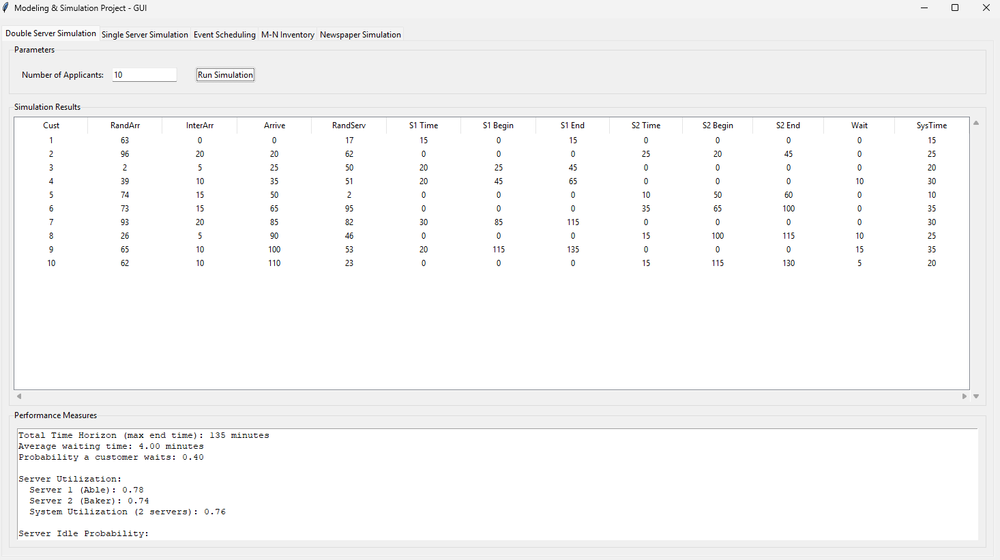
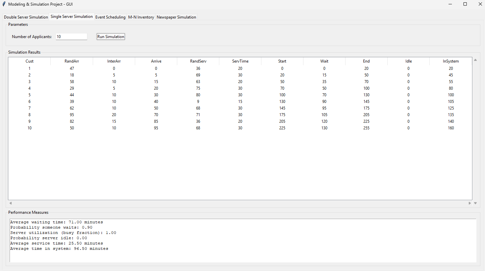
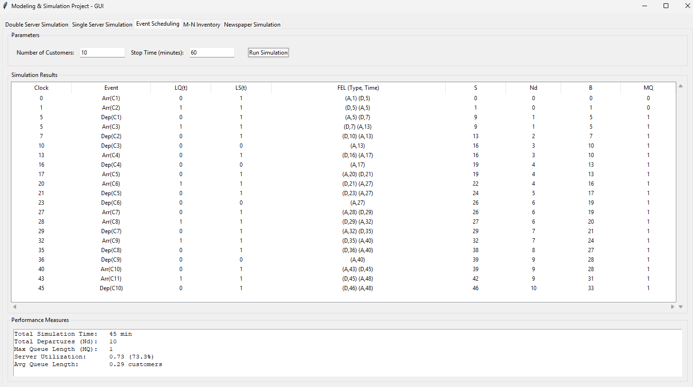
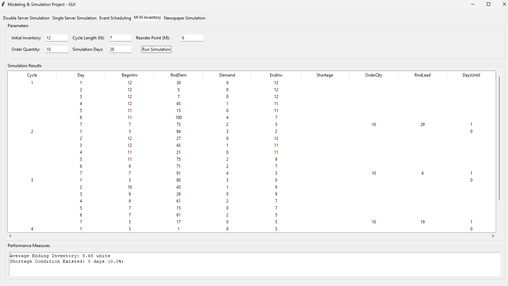

# Modeling & Simulation Project

A comprehensive collection of discrete event simulation models implemented in Python with an intuitive Tkinter GUI. This project demonstrates various classical simulation techniques and queueing systems used in operations research and industrial engineering.

## 📋 Table of Contents

- [Overview](#overview)
- [Features](#features)
- [Simulation Models](#simulation-models)
- [Installation](#installation)
- [Usage](#usage)
- [Project Structure](#project-structure)
- [Technical Details](#technical-details)
- [Screenshots](#screenshots)
- [Requirements](#requirements)
- [Contributing](#contributing)
- [License](#license)

## 🎯 Overview

This project implements five fundamental simulation models commonly used in modeling and simulation courses:

1. **Double Server Queueing System** - Simulates a two-server system with customer arrivals and service
2. **Single Server Queueing System** - Models a basic single-server queue
3. **Event Scheduling Simulation** - Demonstrates discrete event simulation principles
4. **M-N Inventory System** - Implements periodic review inventory management
5. **Newspaper Vendor Problem** - Classic newsvendor stochastic optimization problem

All simulations feature a professional GUI with interactive parameter input, real-time simulation tables, and comprehensive performance metrics.

## ✨ Features

- **Interactive GUI**: Clean, user-friendly Tkinter interface with tabbed navigation
- **Real-time Results**: Dynamic tables displaying simulation events step-by-step
- **Performance Metrics**: Automatic calculation and display of key performance indicators
- **Customizable Parameters**: Adjustable simulation parameters for each model
- **Scrollable Tables**: Professional Treeview widgets with horizontal and vertical scrolling
- **Monte Carlo Simulation**: Uses random number generation for probabilistic modeling
- **Professional Formatting**: Well-structured output with clear performance measures

## 🔬 Simulation Models

### 1. Double Server Simulation
Simulates a queueing system with two parallel servers (Able and Baker). Customers arrive according to a probability distribution and are served by the first available server.

**Key Metrics:**
- Average waiting time
- Server utilization (both servers)
- System utilization
- Probability of customer waiting
- Idle time probability per server
- Average time in system

**Parameters:**
- Number of applicants

### 2. Single Server Simulation
Models a basic M/M/1 queueing system with random arrivals and service times.

**Key Metrics:**
- Average waiting time
- Server utilization
- Probability of waiting
- Average service time
- Average time in system
- Server idle probability

**Parameters:**
- Number of applicants

### 3. Event Scheduling
Demonstrates the event-scheduling approach to discrete event simulation with a Future Event List (FEL).

**Key Metrics:**
- Total simulation time
- Total departures
- Maximum queue length
- Server utilization
- Average queue length

**Parameters:**
- Number of customers
- Stop time (minutes)

### 4. M-N Inventory System
Implements a periodic review (N) with reorder point (M) inventory control policy.

**Key Metrics:**
- Average ending inventory
- Days with shortage
- Shortage percentage

**Parameters:**
- Initial inventory
- Cycle length (N)
- Reorder point (M)
- Order quantity
- Simulation days

### 5. Newspaper Simulation
Solves the classic newsvendor problem with uncertain demand and three types of newsdays (Good/Fair/Poor).

**Key Metrics:**
- Total revenue
- Total cost
- Total lost profit (stockout cost)
- Total salvage value
- Net profit

**Parameters:**
- Number of newspapers to stock
- Simulation days

**Economic Parameters:**
- Cost per paper: $0.33
- Selling price: $0.50
- Salvage value: $0.05

## 🚀 Installation

### Prerequisites
- Python 3.7 or higher
- pip (Python package installer)

### Steps

1. **Clone the repository**
```bash
git clone https://github.com/yourusername/modeling-simulation-project.git
cd modeling-simulation-project
```

2. **Install required packages**
```bash
pip install -r requirements.txt
```

> **Note**: This project uses only Python standard library modules (tkinter, random), so no additional packages are required.

3. **Run the application**
```bash
python simulation_gui.py
```

## 💻 Usage

1. **Launch the application**:
   ```bash
   python simulation_gui.py
   ```

2. **Select a simulation** from the tabs at the top of the window

3. **Enter parameters** in the input fields (default values are provided)

4. **Click "Run Simulation"** to execute the selected model

5. **View results**:
   - Simulation table shows event-by-event progress
   - Performance measures display key metrics at the bottom

### Example: Running the Double Server Simulation

```python
# Launch the GUI
python simulation_gui.py

# In the GUI:
# 1. Select "Double Server Simulation" tab
# 2. Enter number of applicants (e.g., 10)
# 3. Click "Run Simulation"
# 4. Review the results table and performance metrics
```

## 📁 Project Structure

```
Modeling&Simulation Project/
│
├── simulation_gui.py                    # Main GUI application
│
├── Double Server Simulation/
│   ├── debug.py                         # Debug/testing script
│   └── Double-Server-Queueing System.docx
│
├── Single Server Simulation/
│   ├── SingleServerSim.py               # Standalone single server sim
│   └── Single-Server-Queueing System.docx
│
├── Event Scheduling/
│   └── schedule.py                      # Standalone event scheduling sim
│
├── M-N Inventory Simulation/
│   └── mnsim.py                         # Standalone inventory sim
│
├── Modeling Simulation Group Project Overview.docx
└── README.md                            # This file
```

## 🔧 Technical Details

### Architecture
- **Language**: Python 3.x
- **GUI Framework**: Tkinter (ttk widgets)
- **Simulation Approach**: Monte Carlo simulation with discrete event modeling
- **Random Number Generation**: Python's `random` module

### Key Components

#### Main GUI Class
```python
class SimulationGUI:
    - Manages all five simulation tabs
    - Handles user input and parameter validation
    - Displays results in Treeview tables
    - Calculates and formats performance metrics
```

#### Simulation Methods
Each simulation has three main methods:
1. `create_[simulation]_tab()` - Sets up the GUI components
2. `run_[simulation]()` - Handles user interaction and validation
3. `[simulation]_simulation()` - Implements the core simulation logic

### Random Number Mapping
The simulations use the **inverse transform method** for random variate generation:
- Random digits (0-99) are mapped to values based on cumulative probability distributions
- Custom probability tables for arrivals, service times, demand, etc.

### Performance Calculations
- **Queue metrics**: Using Little's Law and time-weighted averages
- **Utilization**: Ratio of busy time to total time
- **Financial metrics**: Revenue, cost, and profit calculations

## 📊 Screenshots







## 📦 Requirements

### Python Version
- Python 3.7+

### Standard Library Modules
- `tkinter` - GUI framework
- `random` - Random number generation
- `ttk` - Themed Tkinter widgets


## 🎓 Educational Value

This project demonstrates:
- **Discrete Event Simulation (DES)** principles
- **Queueing Theory** applications
- **Monte Carlo Simulation** techniques
- **Inventory Management** strategies
- **Stochastic Optimization** (newsvendor problem)
- **GUI Development** with Tkinter
- **Event-driven Programming**
- **Statistical Analysis** of simulation output

## 🤝 Contributing

Contributions are welcome! Here's how you can help:

1. **Fork the repository**
2. **Create a feature branch** (`git checkout -b feature/AmazingFeature`)
3. **Commit your changes** (`git commit -m 'Add some AmazingFeature'`)
4. **Push to the branch** (`git push origin feature/AmazingFeature`)
5. **Open a Pull Request**

### Ideas for Contributions
- Add visualization/plotting of results using matplotlib
- Implement additional simulation models (M/M/c, priority queues, etc.)
- Add data export functionality (CSV, Excel)
- Create statistical analysis tools for multiple simulation runs
- Add animation of queue dynamics
- Implement warm-up period and confidence interval calculations

## 📄 License

This project is licensed under the MIT License - see the [LICENSE](LICENSE) file for details.

## 👥 Author

**Mohannad Abdallah**

## 🙏 Acknowledgments

- Inspired by classical discrete event simulation textbooks
- Built for Modeling & Simulation coursework
- Uses standard queueing theory formulas and performance metrics

## 📞 Contact

For questions, suggestions, or feedback:
- GitHub: [@mohannadx101](https://github.com/mohannadx101)
- Email: mohannadx101@gmail.com
